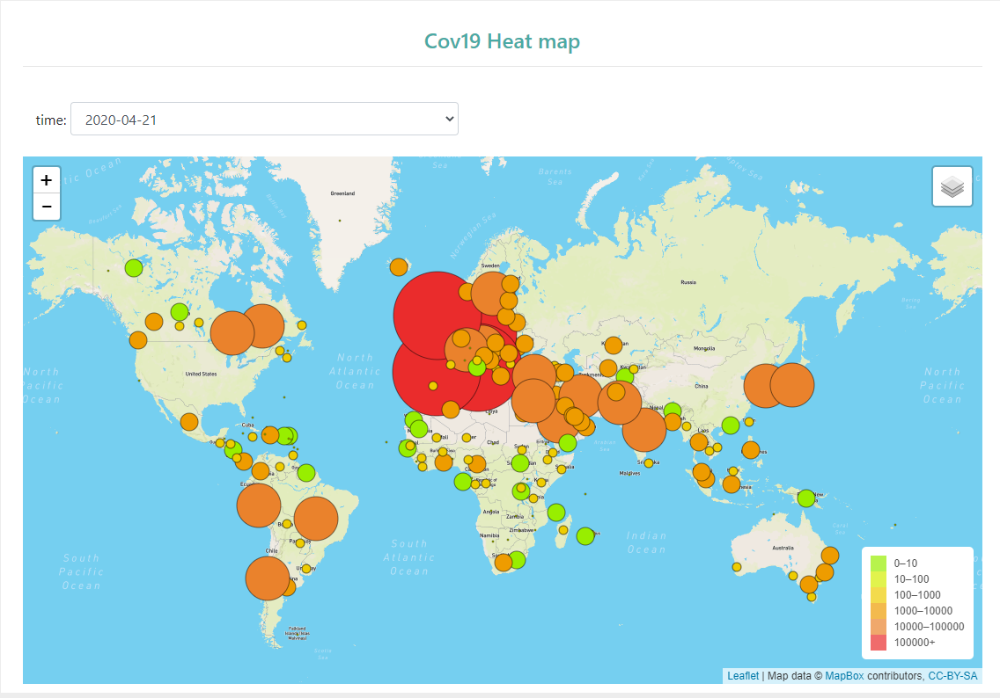
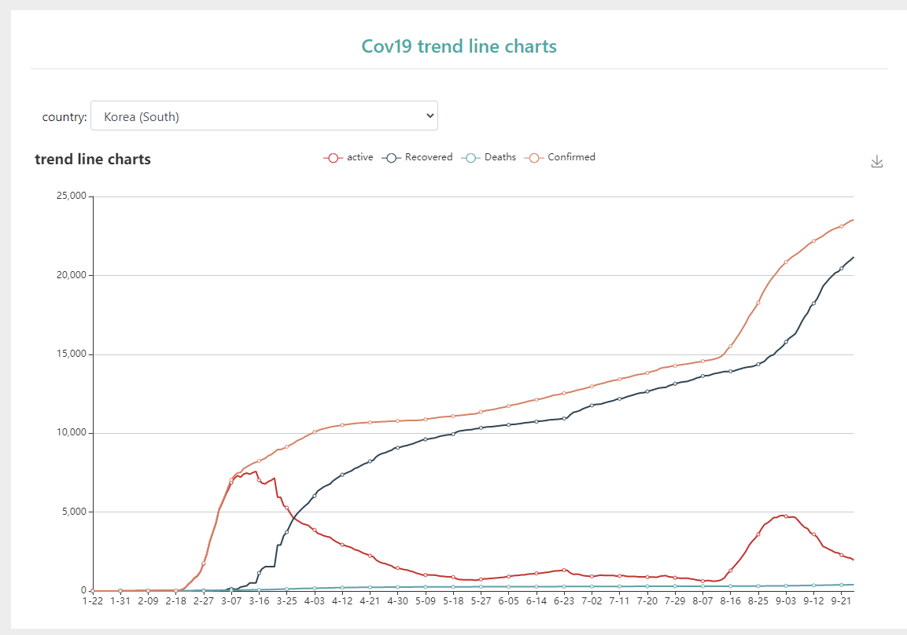

# testing

Project Title : Covid-19 Analysis   
 
Team Members : Nerojan, Prateek, Jialong, Edward  
 
Project Description/Outline
 
Covid-19 has had a dramatic impact on our lives and resulted in the death of many individuals around the world. We will visualize live updates on deaths, total cases, total confirmed and total recovered. 
 
Datasets to Be Used 
https://www.stats.govt.nz/assets/Uploads/Effects-of-COVID-19-on-trade/Effects-of-COVID-19-on-trade-1-February-10-June-2020-provisional/Download-data/Effects-of-COVID-19-on-trade-1-February-10-June-2020-provisional.csv
https://www.kaggle.com/sudalairajkumar/novel-corona-virus-2019-dataset/data?select=covid_19_data.csv
https://documenter.getpostman.com/view/10808728/SzS8rjbc
API
https://rapidapi.com/api-sports/api/covid-193/details

Work Flow  
 
  

Visualizations/Screenshots:  
 

